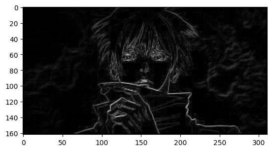

# EdgeDetector
## Most popular and well-known Edge detector on the module


### Example

```python
from AllEdgesDetection import EdgeDetector

EdgeDec=EdgeDetector("image.png")

image_edged=EdgeDec.detect_edges_canny()
# Show the image
plt.imshow(image_edged)

plt.show()

````
# Input


# Result in gray scale


